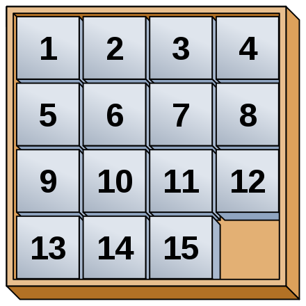

# Simple taquin game

## Introduction

A simple taquin game with web component.

## What is Taquin ?

> The 15-puzzle (also called Gem Puzzle, Boss Puzzle, Game of Fifteen, Mystic Square and many others) is a sliding puzzle that consists of a frame of numbered square tiles in random order with one tile missing. The puzzle also exists in other sizes, particularly the smaller 8-puzzle. If the size is 3×3 tiles, the puzzle is called the 8-puzzle or 9-puzzle, and if 4×4 tiles, the puzzle is called the 15-puzzle or 16-puzzle named, respectively, for the number of tiles and the number of spaces. The object of the puzzle is to place the tiles in order by making sliding moves that use the empty space... [More](https://en.wikipedia.org/wiki/15_puzzle)

> <cite>wikipedia</cite>
